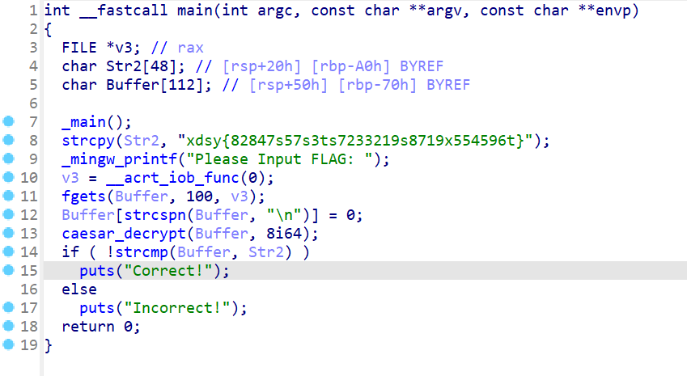
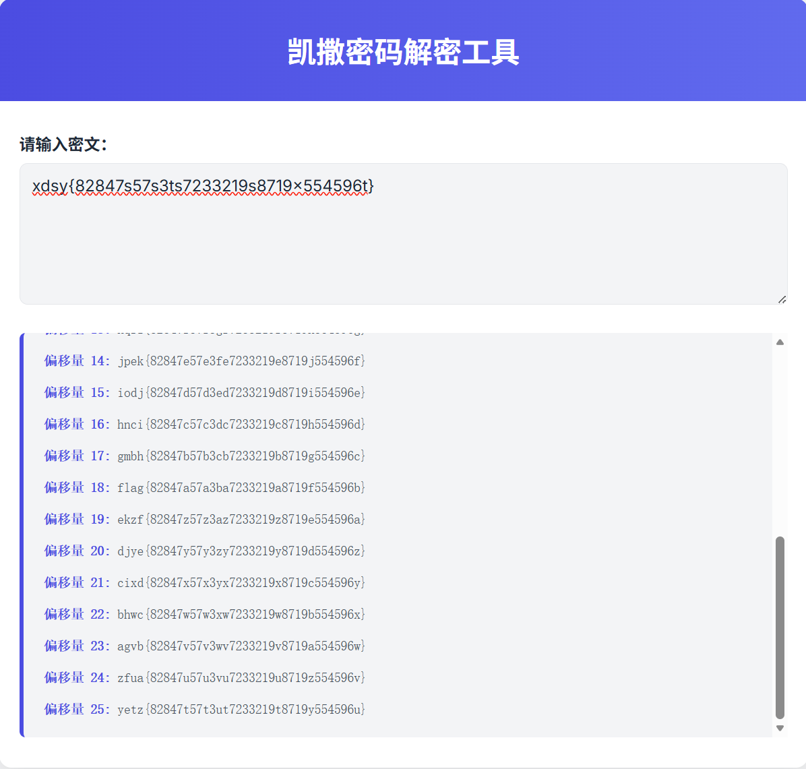
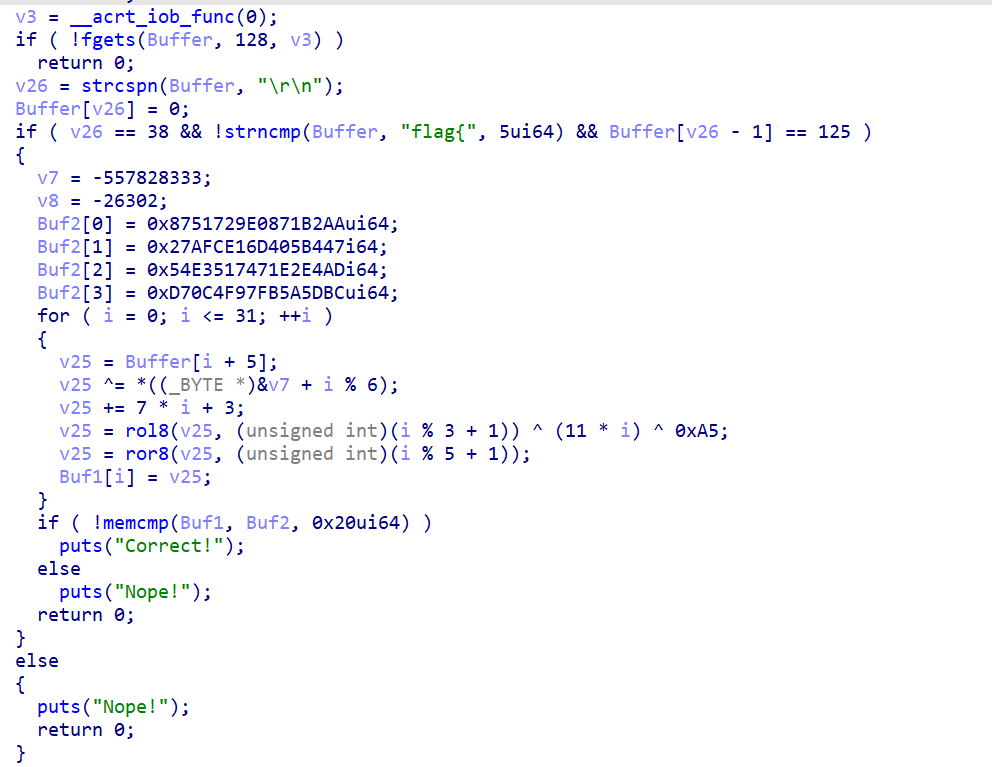
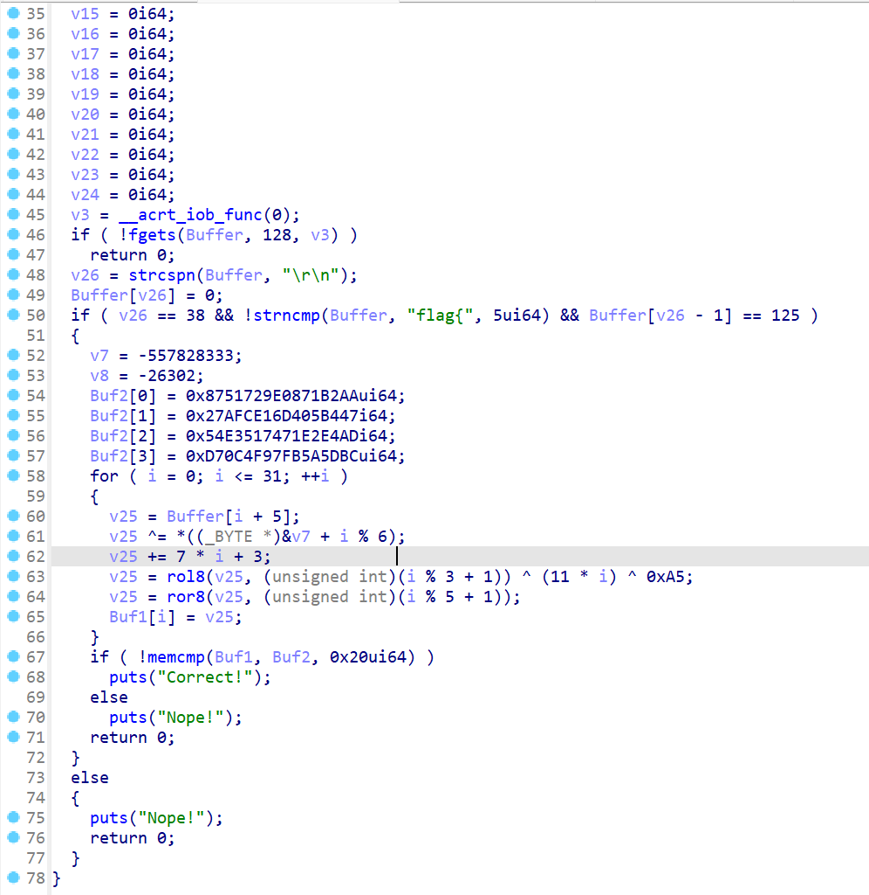
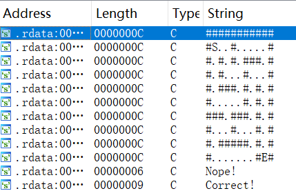
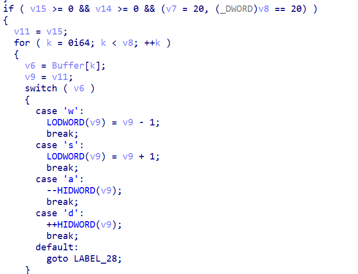
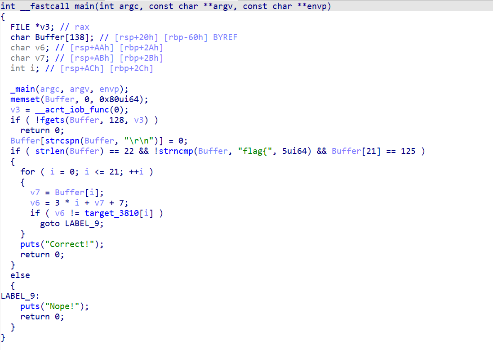
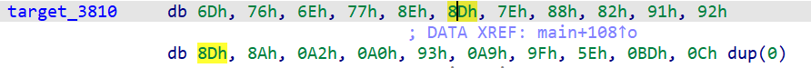

## 题目解题过程

### Reverse-EasyCaesar 解题步骤：
拿到题丢进IDA pro

找到字符串```xdsy{82847s57s3ts7233219s8719x554596t}```，猜测是凯撒密码
丢入```https://tools.081192.xyz/tools/caesar-decode.html```中解密

轻松解出flag：```flag{82847a57a3ba7233219a8719f554596b}```

### Reverse-byte_by_byte 解题步骤：
丢入IDA pro解出伪代码

使用 rol8 (循环左移) 撤销步骤4
逆向 ROL/XOR：先异或 (11 * i) ^ 0xA5，然后使用 ror8 (循环右移) 撤销步骤3的 rol8。
逆向 ADD：减去 7 * i + 3。
逆向 XOR：异或 Key[i % 6]。
编写脚本解出flag
```
import struct

def rol8(val, r_bits):
    r_bits = r_bits % 8
    return ((val << r_bits) | (val >> (8 - r_bits))) & 0xFF
def ror8(val, r_bits):
    r_bits = r_bits % 8
    return ((val >> r_bits) | (val << (8 - r_bits))) & 0xFF

v7 = -557828333
v8 = -26302
key_bytes = list(struct.pack('<i', v7) + struct.pack('<h', v8))
buf2_values = [
    0x8751729E0871B2AA,
    0x27AFCE16D405B447,
    0x54E3517471E2E4AD,
    0xD70C4F97FB5A5DBC
]
target_bytes = []
for val in buf2_values:
    target_bytes.extend(struct.pack('<Q', val))

flag_content = []

for i in range(32):
    v25 = target_bytes[i]
    shift_4 = (i % 5) + 1
    v25 = rol8(v25, shift_4)
    xor_mask = ((11 * i) & 0xFF) ^ 0xA5
    v25 = v25 ^ xor_mask
    shift_3 = (i % 3) + 1
    v25 = ror8(v25, shift_3)
    sub_val = (7 * i + 3) & 0xFF
    v25 = (v25 - sub_val) & 0xFF
    v25 ^= key_bytes[i % 6]
    flag_content.append(chr(v25))

print("flag{" + "".join(flag_content) + "}")
```
flag：```flag{f864517668e8bd4e7469c37fafa71958}```


### Reverse-Easy_Xor 解题步骤：

丢入IDA pro解出伪代码

编写脚本
```
import struct
v5_vals = [
    0x44EA959867464376,
    0xC99C0A263BC3136F,
    0x52236BE1265FA8E7,
    0x86B984038ED0E321
]
target_bytes = b''.join(struct.pack('<Q', val) for val in v5_vals)

v6 = bytearray(7)
struct.pack_into('<I', v6, 0, 2018915346)
struct.pack_into('<i', v6, 3, -558065032)

flag_content = ""
for i in range(32):
    t = target_bytes[i]
    k = v6[i % 7]
    m = (13 * i + 7) & 0xFF
    
    char_code = t ^ k ^ m
    flag_content += chr(char_code)
print(f"flag{{{flag_content}}}")
```
解出flag：```flag{cc119aa449279d37f44d4a26f556b0bd}```

### Reverse-maze 解题步骤：
逆向，在字符串中得到地图

分析代码，接受小写wasd

按照地图反推
flag为：```flag{ddssddwwddddssssssss}```

### Reverse-RE 解题步骤：
逆向，得到伪代码，分析得到与```target_3810```数组有关

查看```target_3810```数组的值，得到flag

编写代码解出flag
```
target_3810 = [0x6D, 0x76, 0x6E, 0x77, 0x8E, 0x8D, 0x7E, 0x88, 0x82, 0x91, 0x92, 0x8D, 0x8A, 0xA2, 0xA0, 0x93, 0xA9, 0x9F, 0x5E, 0xBD, 0x0C]

res = []
for i, val in enumerate(target_3810):
    char_code = val - 3 * i - 7
    res.append(char_code)

print(f"Decoded values: {res}")
print(f"Decoded chars: {[chr(c) if 32 <= c <= 126 else '?' for c in res]}")
```
flag：```flag{welcome_to_re!}```

