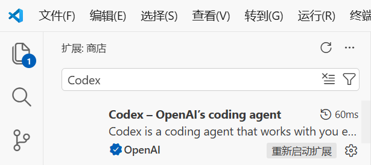
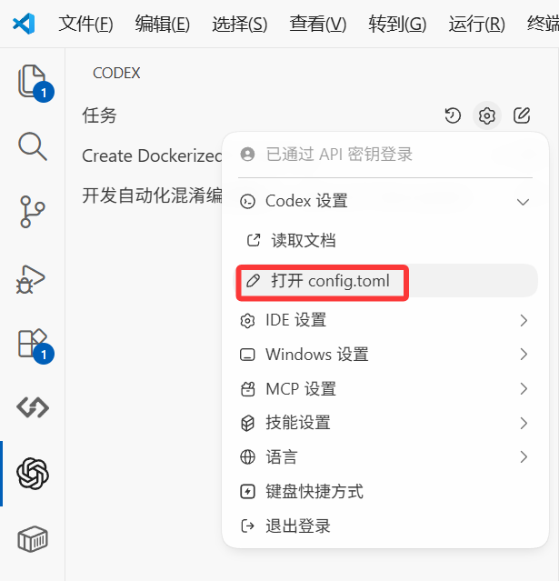

## 配置过程

### 1.在vscode中安装Codex插件
如图，安装第一个插件


### 2.安装Codex-cli
**请先确认自己的电脑上已安装nodejs和npm包管理器**
[安装nodejs](https://nodejs.org/dist/v24.13.1/node-v24.13.1-x64.msi)
安装完后请打开cmd确认是否安装完成，分别输入下面的代码
```
node -v
npm -v
```
如果能正常显示版本号，则说明安装成功，进入下一步，输入命令，使用npm安装Codex-cli（此步骤可能需要魔法上网）
```npm install -g @openai/codex``` 
完成后输入```codex --version``` 确认是否安装成功

### 3.配置Codex
在vscode中打开Codex插件，点击右上角的齿轮图标，在codex设置中打开config.toml，进行编辑

`若无法通过此方法打开config.toml，可参阅下方编辑auth.json的方法，两文件在同一目录中`
将下列代码粘贴进入config.toml中，填入自己的base_url
```
model_provider = "sub2api"              #模型提供商，需要与下面的名字一致
model = "gpt-5.3-codex"                 #你要使用的模型名称
model_reasoning_effort = "high"         #模型推理等级(建议保持)
network_access = "enabled"              #是否允许网络访问(建议保持开启)
disable_response_storage = true         #是否禁止响应存储(建议保持开启)
windows_wsl_setup_acknowledged = true   #是否确认windows wsl设置(建议保持开启)
model_verbosity = "high"                #模型输出等级(建议保持)

[model_providers.sub2api]
name = "sub2api"                        #模型提供商名称，需要与上面的名字一致
base_url = "https://**********"         #你的base_url
wire_api = "responses"                  #保持不变
requires_openai_auth = true             #是否需要openai认证(建议保持开启)
```

打开```%userprofile%\.codex```文件夹，编辑```auth.json```文件，填入自己的OPENAI_API_KEY
(按 Win+R，输入 %userprofile%\.codex 打开配置目录)
```
{
  "OPENAI_API_KEY": "sk-*****************************************"
}
```

自此，搞完收工，可以在vscode中愉快地使用Codex插件了


需要购买codex的可以去[这里](https://foxcode.rjj.cc/auth/register?aff=EPSZEL)(带aff)，也可以自己搭建sub2api等项目使用（free可用codex，因此注册机启动~~！）


