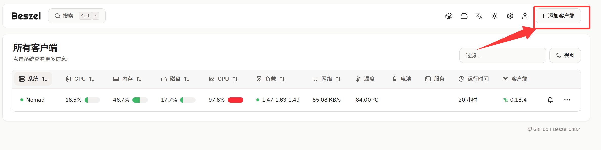
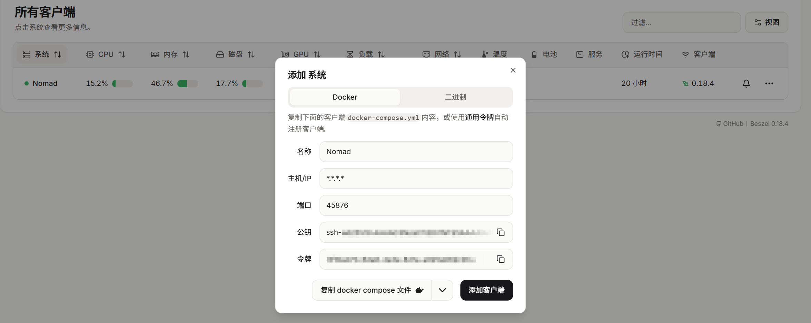

## 一、在Beszel中添加客户端



请记住公钥和令牌，后续要用到

## 二、在Nomad中新建job 连接Beszel

新建job代码如下，保存并运行即可

```Job Definition
job "beszel-agent" {
  datacenters = ["dc1"]
  type        = "system"

  constraint {
    attribute = "${attr.kernel.name}"
    value     = "linux"
  }

  group "agent" {
    network {
      mode = "host"

      # system job 每台机只起一个实例，静态端口 45876 通常可行
      port "beszel" {
        static = 45876
      }
    }

    task "agent" {
      driver = "docker"

      config {
        image        = "henrygd/beszel-agent-nvidia:latest"
        network_mode = "host"
        runtime      = "nvidia"
        volumes = [
          "/var/lib/beszel-agent:/var/lib/beszel-agent",
          "/var/run/docker.sock:/var/run/docker.sock:ro"
        ]
      }

      env {
        # 新变量名是 LISTEN，PORT 已弃用（仍兼容）
        LISTEN  = "45876"
        KEY     = "" # 此处的Key为上一步骤保存的公钥
        TOKEN   = "" # 此处的token为上一步骤保存的令牌
        HUB_URL = "" # 你的Beszel Hub地址
        
        SKIP_GPU = "false"
   		NVIDIA_VISIBLE_DEVICES = "all"
        NVIDIA_DRIVER_CAPABILITIES = "utility"
      }

      resources {
        cpu    = 100
        memory = 128
      }

      service {
        name     = "beszel-agent"
        provider = "nomad"
        port     = "beszel"
      }
    }
  }
}

```