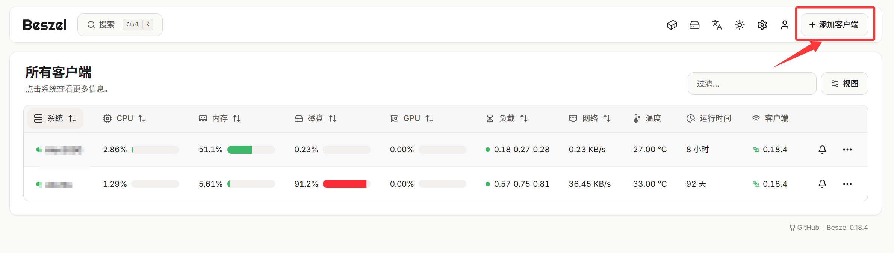

## 一、在Beszel中添加客户端
Beszel Hub部署此处略过，请参照官网部署[Beszel.dev](https://beszel.dev/)





复制通用令牌和SSH公钥，后面连接时要用到。

注意一定是通用令牌并设置为永久，后续才能实现服务器监控的自动添加

## 二、在Nomad中新建job 连接Beszel

新建job代码如下，保存并运行即可
注意，机器需要开启raw_exec才能正常运行beszel监控

```Job Definition
# 这个变量用于控制 job 要部署到哪些 datacenter。
# 默认是 dc1；如果你的 Nomad 环境使用别的 datacenter，可在运行时覆盖。
variable "datacenters" {
  type    = list(string)
  default = ["dc1"]
}

# Beszel Agent system job。
# type = system 表示：每个符合约束条件的 Nomad Client 节点都会部署 1 个 allocation。
job "beszel-agent-system" {
  type        = "system"
  datacenters = var.datacenters

  # 只允许在 Linux 节点上运行。
  constraint {
    attribute = "${attr.kernel.name}"
    value     = "linux"
  }

  # 只允许在启用了 raw_exec 驱动的节点上运行。
  # 因为这个任务会直接在宿主机执行 Beszel Agent，而不是通过容器运行。
  constraint {
    attribute = "${attr.driver.raw_exec}"
    value     = "1"
  }

  group "agent" {
    network {
      mode = "host"

      # 让 Nomad 为每个节点自动分配一个可用端口，避免固定端口冲突。
      port "agent" {
      }
    }

    # 当 agent 异常退出时的重启策略。
    restart {
      attempts = 10
      interval = "1h"
      delay    = "15s"
      mode     = "delay"
    }

    task "beszel-agent" {
      # 使用 raw_exec 直接在宿主机运行二进制。
      driver = "raw_exec"

      # 直接注入 Beszel Agent 所需环境变量。
      # 这里保留原始写法：Hub / Token / 公钥直接写在 job 中。
      env {
        BESZEL_VERSION = "0.18.4"
        HUB_URL        = "你部署的Hub地址"
        TOKEN          = "上一步获取的永久token"
        KEY            = "上一步获取的SSH公钥"
        DATA_DIR       = "/var/lib/beszel-agent"
      }

      # 先执行 Nomad 模板渲染出来的启动脚本。
      config {
        command = "/bin/bash"
        args    = ["-lc", "exec \"$NOMAD_TASK_DIR/start-beszel-agent.sh\""]
      }

      # 启动脚本：负责选择端口、下载 agent、检测 GPU，并最终启动 Beszel Agent。
      template {
        destination = "local/start-beszel-agent.sh"
        perms       = "0755"
        data        = <<-EOF_SCRIPT
          #!/usr/bin/env bash
          set -euo pipefail

          log() {
            printf '[beszel-nomad] %s\n' "$1"
          }

          if [ -z "$BESZEL_VERSION" ]; then
            log "BESZEL_VERSION 未设置，退出"
            exit 1
          fi

          OS=$(uname -s | tr '[:upper:]' '[:lower:]')
          ARCH=$(uname -m)

          # 识别宿主机 CPU 架构，并映射到 Beszel Release 的命名。
          case "$ARCH" in
            x86_64|amd64)
              ARCH="amd64"
              ;;
            aarch64|arm64)
              ARCH="arm64"
              ;;
            armv7l|armv6l|arm)
              ARCH="arm"
              ;;
            ppc64le)
              ARCH="ppc64le"
              ;;
            riscv64)
              ARCH="riscv64"
              ;;
            *)
              log "不支持的 CPU 架构: $ARCH"
              exit 1
              ;;
          esac

          # 优先使用 Nomad 分配的动态端口；如果没有，则回退到 45876。
          LISTEN_VALUE=$(printenv NOMAD_PORT_agent 2>/dev/null || true)
          if [ -n "$LISTEN_VALUE" ]; then
            export LISTEN="$LISTEN_VALUE"
          else
            export LISTEN="45876"
          fi
          log "使用监听端口: $LISTEN"

          STATE_DIR="$DATA_DIR"
          CACHE_DIR="$STATE_DIR/nomad-cache"

          # 优先写入宿主机持久目录；失败时回退到 allocation 目录。
          if ! mkdir -p "$STATE_DIR" "$CACHE_DIR" 2>/dev/null; then
            STATE_DIR="$NOMAD_ALLOC_DIR/beszel-agent-data"
            CACHE_DIR="$NOMAD_ALLOC_DIR/beszel-agent-cache"
            mkdir -p "$STATE_DIR" "$CACHE_DIR"
            export DATA_DIR="$STATE_DIR"
            log "回退到分配目录保存状态: $STATE_DIR"
          fi

          BIN_PATH="$CACHE_DIR/beszel-agent"

          # 第一次启动时下载 Beszel Agent；后续直接复用缓存的二进制。
          if [ ! -x "$BIN_PATH" ]; then
            TMP_DIR=$(mktemp -d)
            trap 'rm -rf "$TMP_DIR"' EXIT
            ARCHIVE_URL="https://github.com/henrygd/beszel/releases/download/v$BESZEL_VERSION/beszel-agent_"$OS"_"$ARCH".tar.gz"
            ARCHIVE_PATH="$TMP_DIR/beszel-agent.tar.gz"

            log "下载 Beszel Agent v$BESZEL_VERSION ($OS/$ARCH)"

            if command -v curl >/dev/null 2>&1; then
              curl -fsSL --retry 5 --connect-timeout 15 "$ARCHIVE_URL" -o "$ARCHIVE_PATH"
            elif command -v wget >/dev/null 2>&1; then
              wget -qO "$ARCHIVE_PATH" "$ARCHIVE_URL"
            else
              log "需要 curl 或 wget 来下载 Beszel Agent"
              exit 1
            fi

            tar -xzf "$ARCHIVE_PATH" -C "$TMP_DIR"
            install -m 0755 "$TMP_DIR/beszel-agent" "$BIN_PATH"
          fi

          # 尽量识别当前节点的 GPU 类型；如果没有 GPU，也正常启动 agent。
          nvidia_found=0
          amd_found=0
          intel_found=0

          if command -v nvidia-smi >/dev/null 2>&1; then
            nvidia_found=1
          fi

          for vendor_file in /sys/class/drm/card*/device/vendor; do
            [ -f "$vendor_file" ] || continue
            case "$(cat "$vendor_file")" in
              0x10de)
                nvidia_found=1
                ;;
              0x1002)
                amd_found=1
                ;;
              0x8086)
                intel_found=1
                ;;
            esac
          done

          # NVIDIA GPU 存在但缺少 nvidia-smi 时给出提示。
          if [ "$nvidia_found" -eq 1 ] && ! command -v nvidia-smi >/dev/null 2>&1; then
            log "检测到 NVIDIA GPU，但宿主机没有 nvidia-smi；请确认已安装驱动工具"
          fi

          # Intel GPU 存在但缺少常用采集工具时给出提示。
          if [ "$intel_found" -eq 1 ] && ! command -v intel_gpu_top >/dev/null 2>&1 && ! command -v nvtop >/dev/null 2>&1; then
            log "检测到 Intel GPU，但宿主机没有 intel_gpu_top 或 nvtop；Intel GPU 监控可能不完整"
          fi

          # 没有 GPU 时只上报主机指标；有 GPU 时记录识别结果。
          if [ "$nvidia_found" -eq 0 ] && [ "$amd_found" -eq 0 ] && [ "$intel_found" -eq 0 ]; then
            log "当前节点未检测到 GPU，Beszel 将仅上报主机指标"
          else
            summary=""
            [ "$nvidia_found" -eq 1 ] && summary="$summary NVIDIA"
            [ "$amd_found" -eq 1 ] && summary="$summary AMD"
            [ "$intel_found" -eq 1 ] && summary="$summary Intel"
            log "检测到 GPU 类型:$summary"
          fi

          # 启动 Beszel Agent 主进程。
          exec "$BIN_PATH"
        EOF_SCRIPT
      }

      # 这个任务本身占用的 Nomad 资源非常低。
      resources {
        cpu    = 100
        memory = 128
      }
    }
  }
}


```