> 特别提醒：本文默认你已经对信息有足够的辨识能力，使用和学习时请遵守您所在的地区的法律法规，本文不对任何不正当使用产生的后果负责

> 本文操作安装及操作环境主要为 Windows电脑+安卓（鸿蒙）手机，苹果用户仅供参考（并未进行实战验证）

# 零、准备工作

**安装工具（cc-switch）**
> CC-Switch 是一个帮助 AI 开发者极其方便地在不同的 AI 模型、API 账号和插件之间来回切换的工具

访问：[https://github.com/farion1231/cc-switch/releases](https://github.com/farion1231/cc-switch/releases)

下载自己电脑对应的版本并安装，后续本教程会使用这个

> 此步骤不是必须，仅作为辅助工具，但是强烈建议安装

# 一、Codex安装及使用教程

## 1.安装ChatGPT桌面端进行使用

[访问Codex官方页面下载](https://chatgpt.com/zh-Hans-CN/codex/) [https://chatgpt.com/zh-Hans-CN/codex/](https://chatgpt.com/zh-Hans-CN/codex/)

> 需要较好的网络环境，否则请参考从微软商店进行下载 https://apps.microsoft.com/detail/9plm9xgg6vks?hl=zh-CN&gl=CN

下载完以后直接安装即可

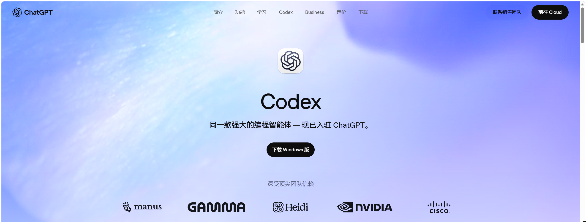

## 2.登录或者使用中转站/Token Plan

打开ChatGPT的桌面端以后，可以选择使用ChatGPT账号登录，也可以使用中转站登录，这里先讲使用账户登录

### (1)使用ChatGPT账户登录

> 使用官方账号的教程，默认您已经学会科学上网以及已经拥有ChatGPT账号或者Google账号，如果没有ChatGPT账号的，请你使用Google登录；没有Google账号的，请你在互联网上寻找Google账号的购买或自行注册

> 打开ChatGPT未显示登录页面的，请在CC-Switch中修改提供商为OpenAI Official
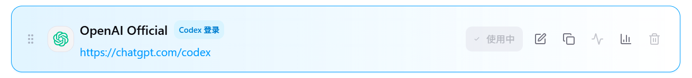

正常显示登录页面的，点击登录按钮，跳转到浏览器使用ChatGPT账号登录

注意：ChatGPT Free的用量极低，并且大概率需要接收外国手机号验证码，而且可能会遇到封号风险，购买Plus/Pro订阅请参照购买订阅章节

### (2)使用中转站API密钥登录

> 请注意，使用中转站有诸多风险，请你确保在您能承受的范围内使用

> 风险包括但不限于：使用劣质模型掺假、倒卖用户对话记录（可能包含隐私数据）、中转站跑路不退费、提示词攻击、计费倍率一天一个价、计费倍率不透明等

> 因此，我们强烈建议向中转站充值的时候，随用随充，防止跑路

首先，找一个中转站使用（文末有便宜和相对稳定的推荐，仅供参考，本文不对推荐的中转站提供的任何服务负责，请自行辨别）

在中转站中，充值，选择合适的分组，然后获取到你的API_KEY使用

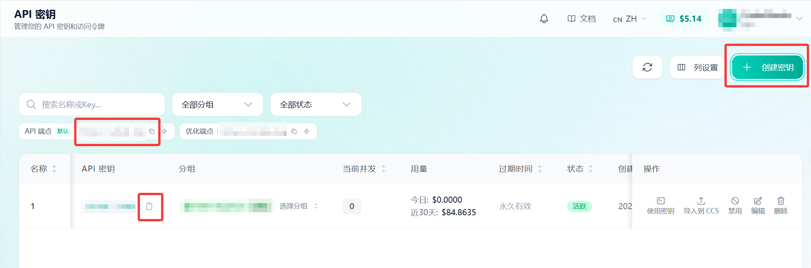

接下来，将API_KEY和BASE_URL填入CC-Switch中

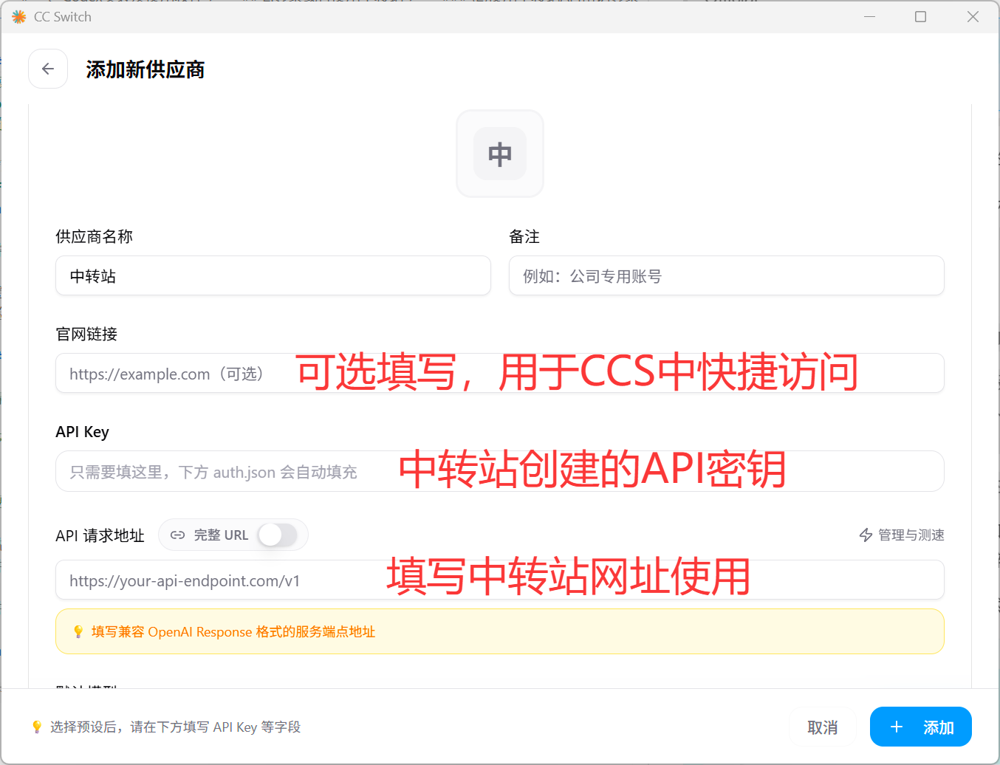

保存添加后即可使用（注意，切换供应商需要重启ChatGPT客户端）

至此，你已经可以正常使用了

### (3)使用国内厂商Coding Plan/Token Plan/API

当你不愿意承担中转站风险或者ChatGPT封号等问题，可以使用国内大厂的Plan订阅，或者直接使用Deepseek等模型的API，厂商的文档中都有详细的配置教程，你也可以直接获取密钥填入CCS中，CCS中预设了大量厂商的配置

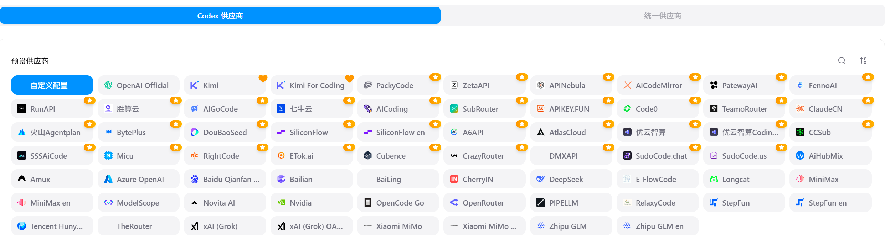

下面是部分推荐的，大家理性购买

  
硅基流动(不太推荐，但是有16元赠金)

  > 硅基流动平台，使用API调用各类模型（价格偏贵，不太推荐，但是可以通过下面的链接领取16元试用金，用完后不建议继续使用）https://cloud.siliconflow.cn/i/LY7IVt6G
  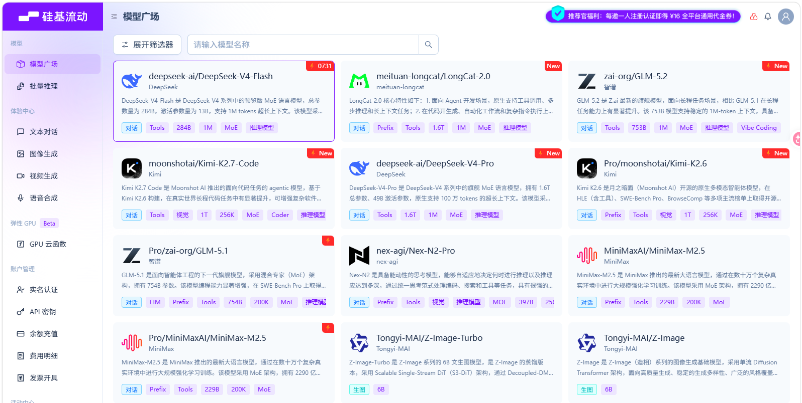

  
方舟Coding Plan（相对比较便宜）

  > 方舟 Coding Plan 最新支持 GLM-5.3、DeepSeek-V4-flash 正式版、Doubao-Seed-2.1-turbo、MiniMax-M3 等模型，工具不限，现在订阅叠加 9.5 折，低至 9.4 元，订阅越多越划算！立即订阅：https://volcengine.com/L/UmNXLr63U88/  邀请码：T2GHUJVT
  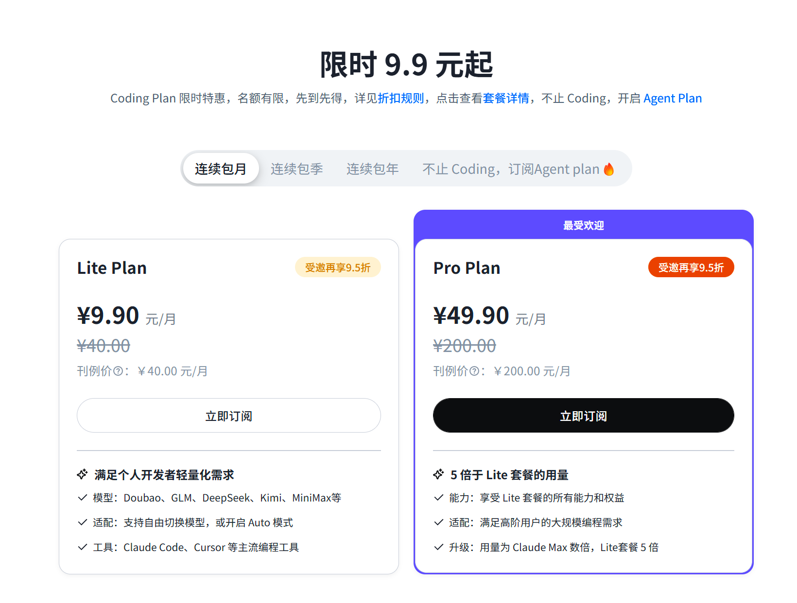

  
智谱 AI Coding Plan（不太好抢到）

  >智谱 AI Coding Plan 是面向开发者和团队的 AI 编程订阅套餐，支持代码生成、调试、自动化任务及多种开发工具，覆盖 GLM 系列旗舰模型。https://bigmodel.cn/glm-coding
  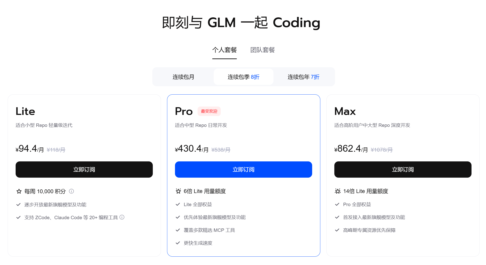

  
Deepseek API（按量付费 涨价后较贵）

  > Deepseek API使用: https://platform.deepseek.com/
  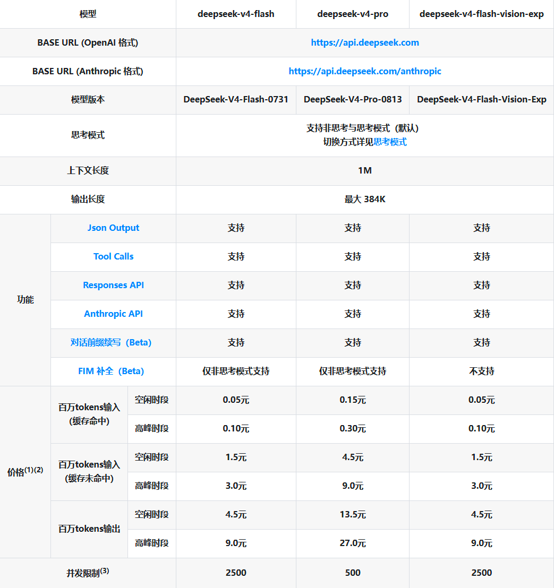

# 二、购买ChatGPT Plus/Pro（安卓/鸿蒙教程）
## 1.前置准备：
一张可以用来境外支付的银行卡

> 如果没有，可以申请一张招商银行MasterCard万事达储蓄卡，随意一个招行网点都可以正常办理，手机银行可以提前预约，下卡很快，当天就可以拿卡了使用

## 2.将这张银行卡绑定到Google账户上
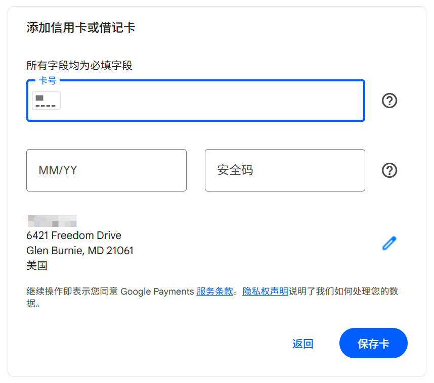

> 注意，这里地址请填写美国免税州的地址，可以少一笔税费，具体可以先询问AI以后再在Google地图上寻找一个地址使用（不要和我用一样的地址）

## 3.将Google账号登录到手机上并购买订阅

此步骤非华为手机都会默认自带完整的Google框架，可以直接在应用商店中换到其他地区，下载 ChatGPT手机应用，Google，Gmail，并且将Google账号登录在手机上

>这一步下载异常的请检查网络环境或者使用Google商店使用

然后，打开ChatGPT应用并登录，然后点击获取Plus（Pro订阅请先购买Plus，然后再手动升级）
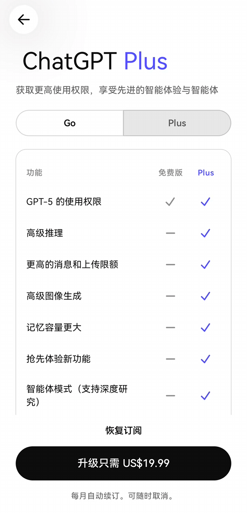  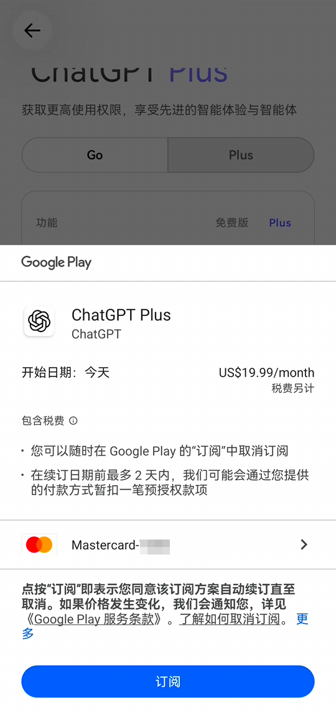

> 此步骤华为手机请使用手机自带的卓易通下载ChatGPT，卓易通自带谷歌框架，使用同样需要魔法网络环境

> 苹果手机请尝试咸鱼/淘宝购买外区礼品卡使用，最为稳定有性价比

  
注册外区iCloud账号

    1.准备一个全新的邮箱（国内163邮箱、qq邮箱等等均可，我用的谷歌邮箱）

    2.关闭代理，以真实网络环境访问 https://www.icloud.com（苹果iCloud 官网，国内网络环境可直连）

    3.在iCloud 官网创建apple账号，创建时地区选择想要注册账号的地区（建议挑选相应地区的免税州），出生日期18+，邮箱填准备的，电话号码填写国内+86手机号（一个手机号应该可以同时注册2～3个apple账号，我一个手机号注册了3个）；创建过程中会分别验证邮箱和手机号，正常验证即可

    4.注册好了后登录iCloud 官网在个人信息处可以看到账号所处的地区

    上述流程走完即可注册成功；

    使用建议：个人apple账户（设置里面的账户）保留原有的，app store可以单独登录外区账号

# 附录、中转站列表（仅供参考）

> 请注意，使用中转站有诸多风险，请你确保在您能承受的范围内使用

> 风险包括但不限于：使用劣质模型掺假、倒卖用户对话记录（可能包含隐私数据）、中转站跑路不退费、提示词攻击、计费倍率一天一个价、计费倍率不透明等

> 因此，我们强烈建议向中转站充值的时候，随用随充，防止跑路

[AIHUB](https://aihub.dog/register?aff=6JT7HL7WCNUL)

[AI GateWay](https://gateai.cc/register?aff=JL9WB9UD6A8X)

[FluxionAI](https://fluxionai.space/register?aff=KE9RGD7MVFYL)

[CUN.AI](https://www.cun.ai/sign-up?aff=9LIk)